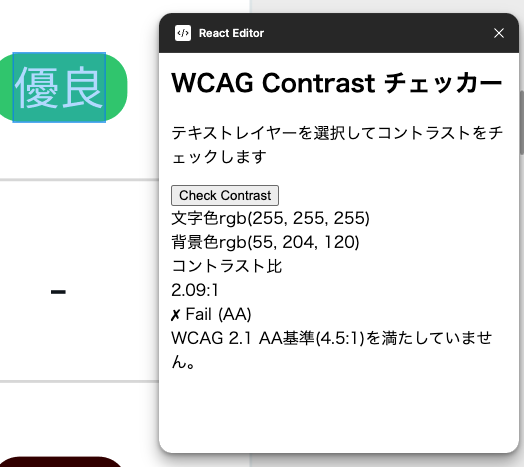

# WCAG Contrast Checker

A Figma plugin that automatically calculates the contrast ratio between text and background colors, helping designers ensure their designs meet WCAG 2.1 AA accessibility standards.


## Features

- ✅ **Automatic Contrast Calculation**: Calculates contrast ratio using WCAG 2.1 formula
- 🎯 **WCAG AA Compliance Check**: Validates against 4.5:1 minimum ratio
- 🎨 **Color Visualization**: Displays text and background colors with RGB values
- ⚡ **Real-time Feedback**: Instant Pass/Fail judgment
- 🌐 **Japanese UI**: User interface in Japanese

## Screenshots



## How It Works

1. Select a text layer in Figma
2. Click "Check Contrast" button
3. View the contrast ratio and WCAG AA compliance status

The plugin:
- Extracts the text color from the selected text layer
- Finds the background color by traversing parent elements
- Calculates relative luminance for both colors
- Computes the contrast ratio: `(L_lighter + 0.05) / (L_darker + 0.05)`
- Validates against WCAG 2.1 AA standard (4.5:1)

## Installation

### For Development

1. **Prerequisites**
   - [Node.js](https://nodejs.org) v22 or higher
   - [Figma desktop app](https://figma.com/downloads/)

2. **Clone and Install**
   ```bash
   git clone https://github.com/junhongo-ccs/wcag-contrast-checker.git
   cd wcag-contrast-checker/react-editor
   npm install
   ```

3. **Build the Plugin**
   ```bash
   npm run build
   ```

4. **Load in Figma**
   - Open Figma desktop app
   - Press `Cmd + /` (Quick Actions)
   - Search for "Import plugin from manifest..."
   - Select the `manifest.json` file from the project

### For Users

*Coming soon: This plugin will be published to Figma Community*

## Development

### Build Commands

```bash
# Production build
npm run build

# Development mode (auto-rebuild on changes)
npm run watch
```

### Tech Stack

- **Framework**: [Create Figma Plugin](https://yuanqing.github.io/create-figma-plugin/)
- **UI Library**: Preact (React-compatible)
- **Language**: TypeScript
- **Styling**: CSS with custom properties

### Project Structure

```
react-editor/
├── src/
│   ├── main.ts          # Plugin main thread (Figma API)
│   ├── ui.tsx           # UI components (Preact)
│   ├── types.ts         # TypeScript type definitions
│   └── styles.css       # Component styles
├── build/               # Generated build output
├── manifest.json        # Figma plugin manifest (generated)
└── package.json         # Project configuration
```

### Debugging

Use `console.log()` to inspect values. To view logs:
1. Press `Cmd + /` in Figma
2. Search for "Show/Hide Console"
3. View console output

## WCAG Resources

- [WCAG 2.1 Guidelines](https://www.w3.org/TR/WCAG21/)
- [Contrast Ratio Definition](https://www.w3.org/TR/WCAG21/#dfn-contrast-ratio)
- [Understanding WCAG Success Criterion 1.4.3](https://www.w3.org/WAI/WCAG21/Understanding/contrast-minimum.html)

## Contributing

Contributions are welcome! Please feel free to submit a Pull Request.

## License

MIT

## Credits

Built with [Create Figma Plugin](https://yuanqing.github.io/create-figma-plugin/) by [@yuanqing](https://github.com/yuanqing)

## Author

Created by [junhongo-ccs](https://github.com/junhongo-ccs)
